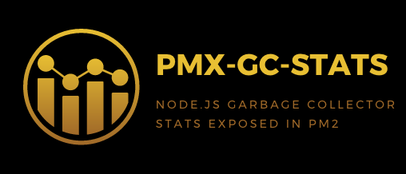

<p align="center">
  
<p>

<p align="center">
  Stats about Node.js V8 garbage collector are exposed in PM2 for each GC type executed using PMX probes.
<p>

# Table of Contents
- [Presentation](#presentation)
- [Requirements](#requirements)
- [Installation](#installation)
- [Technical information](#technical-information)
  - [Node.js](#node.js)
  - [Tests](#tests)
    - [Linting](#linting)
    - [Unit](#unit)
    - [PM2](#pm2)
- [Usage](#usage)
  - [Import](#import)
  - [pmxGcStats(\[options\])](#pmxgcstats-options-)
  - [PMX probes](#pmx-probes)
    - [GC types](#gc-types)
    - [Probes suffixes](#probes-suffixes)
    - [Example](#example)
    - [Display probes](#display-probes)
- [Development](#development)
- [Licence](#licence)

# Presentation

Stats about Node.js V8 garbage collector are exposed in PM2 for each GC type executed using PMX probes.

For improvement and maintenance of the code originally made here: [pmx-gc-stats-sum](https://github.com/gleaute/pmx-gc-stats-sum)

# Requirements

- Any PM2 version installed globally:

`npm install -g pm2`

# Installation

`npm install pmx-gc-stats`

`npm i -S pmx-gc-stats`

If you have issues with *node-gyp* when installing the module, install the latest version of NPM:

`npm i -g npm@latest`

# Technical information

## Node.js

- Language: JavaScript ES6/ES7
- VM: Node.js >=10.0.0

## Tests

Command to run all tests:

`npm test`

### Linting

ESLint with Airbnb base rules. See [Airbnb JavaScript Style Guide](https://github.com/airbnb/javascript).

`npm run test:lint`

### Unit

Mocha and Chai.

`npm run test:unit`

### PM2

To launch the testing app:

`npm run start:pm2`

To show PM2 metrics:

`pm2 monit`

`pm2 show test-app`

To stop the testing app:

`npm run stop:pm2`

# Usage

### Import

**It is necessary to require this package before any other module launches.**

*pmx-gc-stats* module exports one function named *pmxGcStats*.

```javascript
const pmxGcStats = require('pmx-gc-stats');
pmxGcStats();

// or directly calling the function
require('pmx-gc-stats')();
```

### pmxGcStats([options])
Stats about Node.js V8 garbage collector are exposed in PM2 for each GC type executed using PMX probes.
  - `options`**<Object\>** *Default*: `undefined`
    - `types`**<Array\>** GC types selected as **<Integer\>**
      - `1`
      - `2`
      - `4`
      - `8`
      - `15`

      *Default*: all of the above values
    - `probes`**<Array\>** probes selected as **<String\>**
      - `count`
      - `pause`
      - `total-heap-size`
      - `total-heap-executable-size`
      - `used-heap-size`
      - `heap-size-limit`
      - `total-physical-size`
      - `total-available-size`
      - `malloced-memory`
      - `peak-malloced-memory`

      *Default*: all of the above values
  - Returns: **undefined**

Examples:
```javascript
const pmxGcStats = require('pmx-gc-stats');
pmxGcStats();

// or directly calling the function
require('pmx-gc-stats')({
  types: [1, 2, 4],
  probes: ['count', 'pause', 'total-heap-size' ],
});
```

### PMX probes

*pmx-gc-stats* exposes PMX probes showing the Node.js V8 garbage collector statistics below visible in PM2.

There are 5 different garbage collector types and for each type 9 probes are exposed.

Metrics format are `gc-type-{type}-{suffix}`.

#### GC types

|      type      |                 description               |
| :------------- | :---------------------------------------- |
| *1*            | Scavenge (minor GC)                       |
| *2*            | Mark/Sweep/Compact (major GC)             |
| *4*            | Incremental marking                       |
| *8*            | Weak/Phantom callback processing          |
| *15*           | All                                       |

#### Probes suffixes
For each GC type:

| suffix | type | description | unit |
| :----- | :--- | :---------- | :--- |
| *count* | count | Number of times this GC type has been executed | - |
| *pause* | sum | Total pause time from start to end of GC using hrtime() | nanoseconds |
| *diff-total-heap-size* | sum | Total size difference allocated by V8 for the heap from the last stats events; this can grow if usedHeap needs more | bytes |
| *diff-total-heap-executable-size* | sum | Total size difference for compiled bytecode and JITed code from the last stats events | bytes |
| *diff-used-heap-size* | sum | Total size difference in use by application data from the last stats events | bytes |
| *diff-heap-size-limit* | sum | Total difference from the last stats events regarding the absolute limit the heap cannot exceed | bytes |
| *diff-total-physical-size* | sum | Total committed size difference (node 0.11+) from the last stats events | bytes |
| *diff-total-available-size* | sum | Total available heap size difference (node 4+) from the last stats events | bytes |
| *diff-malloced-memory* | sum | Total dynamically allocated memory size difference from the last stats events | bytes |
| *diff-peak-malloced-memory* | sum | Total dynamically allocated memory size peak difference from the last stats events | bytes |

#### Example

| GC type 15                                 |
| :----------------------------------------- |
| gc-type-15-count                           |
| gc-type-15-pause                           |
| gc-type-15-diff-total-heap-size            |
| gc-type-15-diff-total-heap-executable-size |
| gc-type-15-diff-used-heap-size             |
| gc-type-15-diff-heap-size-limit            |
| gc-type-15-diff-total-physical-size        |
| gc-type-15-diff-total-available-size       |
| gc-type-15-diff-malloced-memory            |
| gc-type-15-diff-peak-malloced-memory       |

#### Display probes

`pm2 monit`

`pm2 show your-app-name`

# Development

All contributions are greatly welcome :)

Please follow Git flow, ES6/7, ESLint Airbnb base rules.

# Licence

*pmx-gc-stats* is released under the MIT license.

Copyright (C) 2020 Adrien Valcke

Permission is hereby granted, free of charge, to any person obtaining a copy of this software and associated documentation files (the "Software"), to deal in the Software without restriction, including without limitation the rights to use, copy, modify, merge, publish, distribute, sublicense, and/or sell copies of the Software, and to permit persons to whom the Software is furnished to do so, subject to the following conditions:

The above copyright notice and this permission notice shall be included in all copies or substantial portions of the Software.

THE SOFTWARE IS PROVIDED "AS IS", WITHOUT WARRANTY OF ANY KIND, EXPRESS OR IMPLIED, INCLUDING BUT NOT LIMITED TO THE WARRANTIES OF MERCHANTABILITY, FITNESS FOR A PARTICULAR PURPOSE AND NON INFRINGEMENT. IN NO EVENT SHALL THE AUTHORS OR COPYRIGHT HOLDERS BE LIABLE FOR ANY CLAIM, DAMAGES OR OTHER LIABILITY, WHETHER IN AN ACTION OF CONTRACT, TORT OR OTHERWISE, ARISING FROM, OUT OF OR IN CONNECTION WITH THE SOFTWARE OR THE USE OR OTHER DEALINGS IN THE SOFTWARE.
